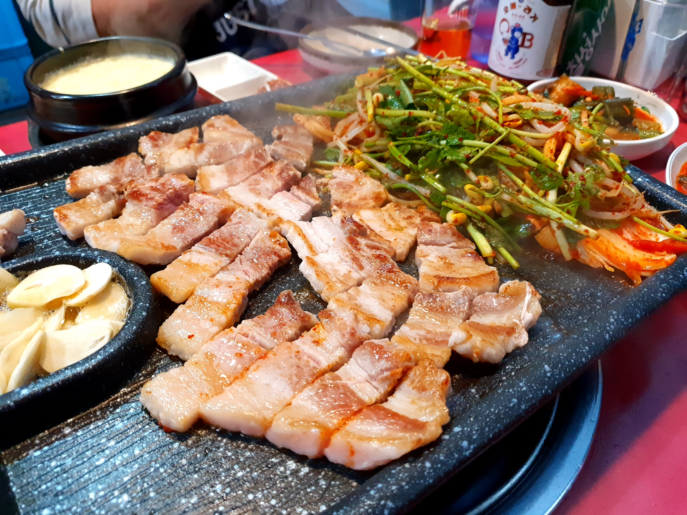
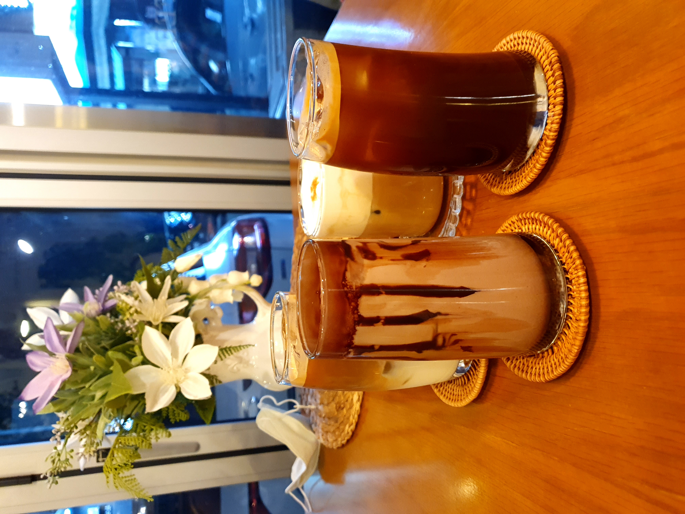

# Retrospective

- 아무것도 남기지 않으면 아무것도 남지 않을 것입니다.

- ‘회고’는 단언컨대, 조직을 가장 빠르고 정확하게 발전시킬 수 있는 가장 효율적인 조직문화이자 프로세스다. 새로운 사람을 뽑을 필요도 없고, 뭔가 장비를 사줘야할 필요도 없다. 조직의 측면에서 보면 비용이 거의 들지 않는다.

### 회식 19:00 ~ 21:30
미금역 [돈꿈이야](https://store.naver.com/restaurants/detail?id=21145518)
- 데모 지각비 만원 사용
- 카일리 1시간 지각!! (서울로 가버림)
- 데모 장애 대응 걱정으로 노트북 챙겨옴 
- 엄뉴 "토비 좋아해"
- 카일리 "6개월만에 카카오 일화"

### 디저트 22:00 ~ 22:30
미금역 [꽃한아름](https://map.naver.com/v5/entry/place/1302971794?c=14149506.7262109,4487746.9181079,15,0,0,0,dh)
- wenmoe 네이밍 뜻 알려줌, 카카오 오면 "지니"라는 이름 쓸거
